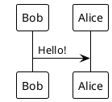

再见Matlab! Mathematica来辣! 
<!--more-->

---

## 前置知识
## 0 帮助文档
`? NAME`
## 1 常用命令
命令内容写在`[]`内
### 1.1 基本数学运算
- 圆周率 `Pi`
- 自然常数 `E`
- 虚数 `I`
- 赋值 `=`
	赋值`x=1`,之后会自动带入,取消赋值`x=.`
- 近似 `N[EXPRESSION, DECIMAL_NUMBER]`
	Mathematica给出近似小数
### 逻辑运算
`If[LOGIC,TRUE,FALSE]` 相当于一个三元运算符
### 1.2 化简 `Simplify`
### 1.3 因式分解 `Factor`
### 1.4 解方程
`Solve[{EQUITIONS},{VAR}]`
`{EQUITION}`可以有多个方程, 用逗号分割, 方程应该使用`==`双等号
`{VAR}`为待求解变量
`DSolve[]`
### 1.5 导数/积分
`D[FUNKTION,VAR]`
`Integrate[FUNKTION,VAR]`无穷积分
`Integrate[FUNKTION,{VAR, MIN, MAX}]`无穷积分
### 1.6 展开式
`Series[FUNKTION, {VAR, LOCATION, ORD}]`
### 1.7 极限
### 1.8 定义函数
`FUNKTION_NAME[VAR_]:=`
## 2 画图
### 2.1 二维图像
`Plot[FUNKTION, {VAR, X_MIN, X_MAX}]`
`PlotLabels->{LABEL1, LABEL2}`

## 参考

